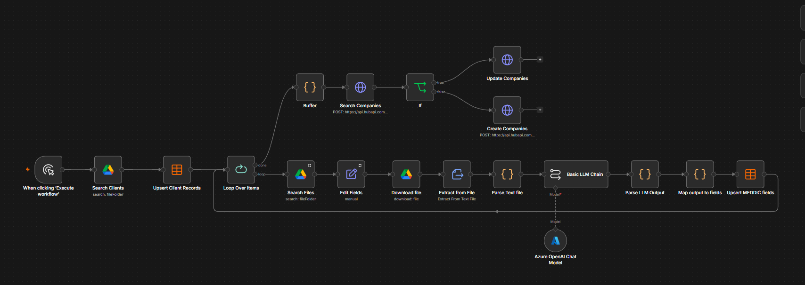

# MEDDIC Dashboard from Sales Call Transcripts

An n8n workflow that uses Claude to extract MEDDIC data from sales call transcripts, scoring each dimension on confidence and completeness, then writes results into HubSpot automatically. Gives teams a consistent, searchable qualification record and lets managers track MEDDIC adoption.

📹 [Full video walkthrough](https://drive.google.com/file/d/1yymJQFpajdgqF2F32QFcTpcXSzRJDn3z/view?usp=sharing)

## Problem

Sales reps consistently under-document deals after calls. MEDDIC (Metrics, Economic Buyer, Decision Criteria, Decision Process, Identify Pain, Champion) is a well-established enterprise sales methodology built around six pillars, but manually checking whether a rep covered each one, and how well, is tedious and inconsistent from rep to rep. The result is patchy CRM data that managers can't rely on for forecasting or coaching.

There is also no easy way to answer a more strategic question: does actually adhering to MEDDIC correlate with deals closing? Without structured data across deals and reps, that stays a guess instead of something you can measure.

## Solution

The workflow runs end to end with no manual input from the rep:

1. **Ingest:** The workflow watches a Google Drive folder structured with one subfolder per client (five clients in the demo), each containing one or more sales call transcripts for that account. This is a drop-in replacement for a source like Gong; the same workflow would work by swapping this node for a Gong export/API pull.
2. **Parse:** Each transcript file is retrieved and parsed into clean text the LLM can process.
3. **Score:** The text is passed to a Claude agent prompted against a fixed rubric. For each of the six MEDDIC pillars, the agent scores 0 to 2 (0 = not addressed, 1 = came up in conversation, 2 = actively addressed), for a maximum overall score of 12. Alongside each pillar score, the agent also returns the reasoning behind that score and a confidence level.
4. **Store:** All extracted fields (overall score, per-pillar scores, reasoning, and confidence) are written into a data table, one row per client, which also powers a static dashboard for sales managers to see how each deal is performing and where there's room for improvement.
5. **Sync to CRM:** After looping through all clients, the workflow pushes the data to HubSpot. For each client it searches for an existing company record; if one exists it updates it with the latest MEDDIC data, and if not it creates a new company record first.

## Expected Outcome

- Every deal gets a consistently scored MEDDIC profile, updated automatically after each call with zero manual data entry
- HubSpot becomes a searchable, structured record of how deals were qualified, not just whether they closed
- A dashboard view gives sales managers an at-a-glance read on deal health and coaching opportunities, without digging through call recordings
- Over time, the same structured scores make it possible to actually test whether MEDDIC adoption correlates with deal closure, rather than assuming it does

## Stack

n8n · Claude (Anthropic) · Google Drive · HubSpot API

## Setup Notes

- Requires a Google Drive connection to the folder structure containing per-client transcript subfolders (or swap for Gong/another call-recording source)
- Requires an Anthropic API key for transcript scoring
- Requires a HubSpot private app token with read/write access to Company records and custom properties
- HubSpot custom properties for each MEDDIC pillar (score, reasoning, confidence) should be created ahead of time to match the workflow's field mapping
- The company search-or-create logic matches on company name; adjust if your source data doesn't map cleanly to existing HubSpot records
